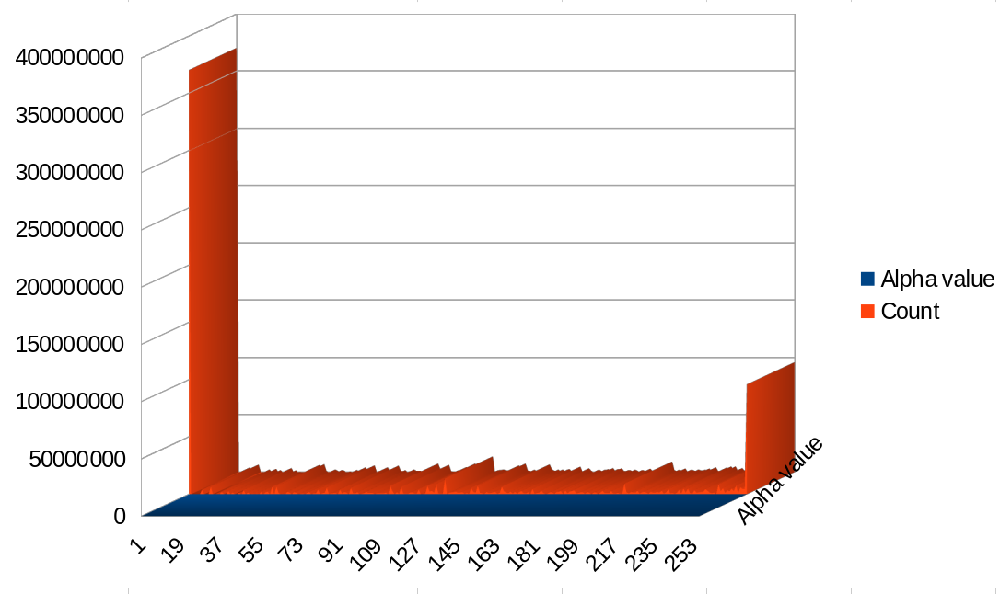

# This is a WIP, do not use!
It will be a single-header version of my ../sw-render library

# Compiling
```
gcc $(pkg-config --cflags freetype2) -lfreetype -lm

# On my Linux Mint computer, the output of this command:
# pkg-config --cflags freetype2
-I/usr/local/include/freetype2 -I/usr/include/libpng16 -I/usr/include/harfbuzz -I/usr/include/glib-2.0 -I/usr/lib/x86_64-linux-gnu/glib-2.0/include
```

# Changes

`struct SWRender` was changed to `struct swr_output`

`swr_draw_fill_background()` was changed to `swr_draw_fill()`

# Text transparency value frequency

</img>
