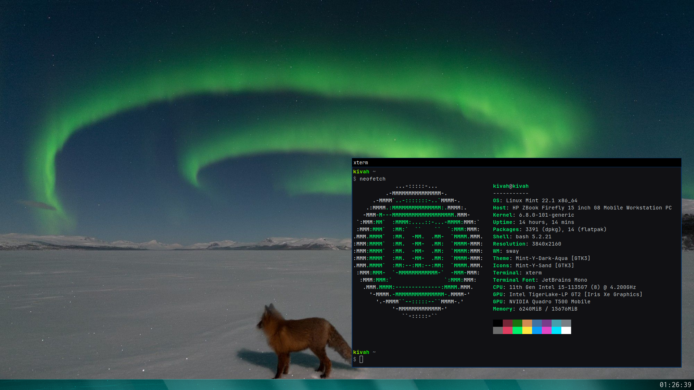

## taskbar

Work-in-progress taskbar for swaywm

</img>

The wayland API stuff in `main.c` was all written by ChatGPT because the Wayland API is annoying

The included [Lekton-Regular-Edited](assets/Lekton-Regular-Edited.ttf) font is licensed under the OFL-1.1. A copy of this license is included in [assets/OFL.txt](assets/OFL.txt). \
It is a modified version of [Lekton](https://fonts.google.com/specimen/Lekton) with the following changes:

- The highest point of the `0` (zero) symbol was moved down by 1 (1/1000 EM unit)
- The lowest two points of the `9` (nine) symbol were moved up by 8 (8/1000 EM unit)
